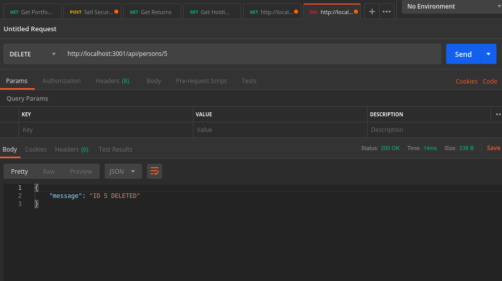
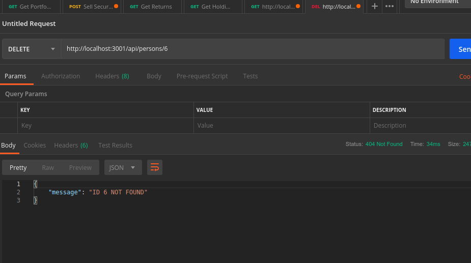
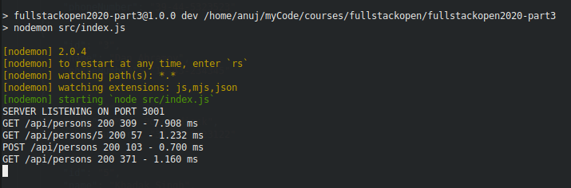
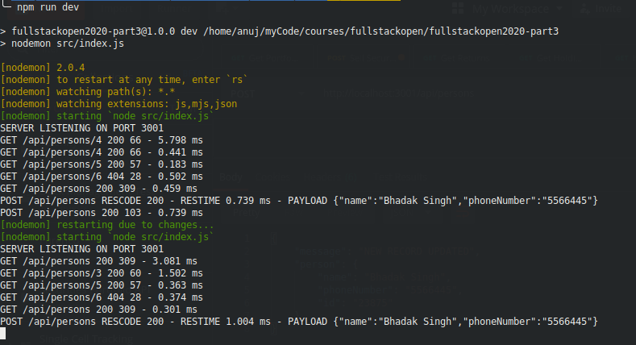
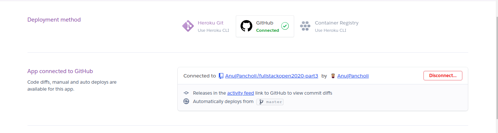
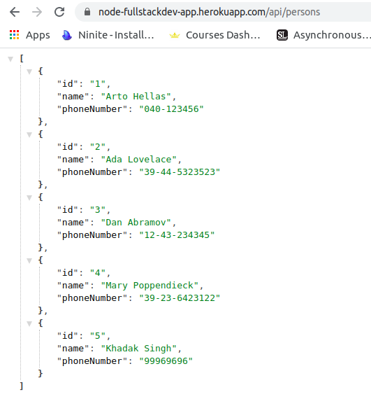
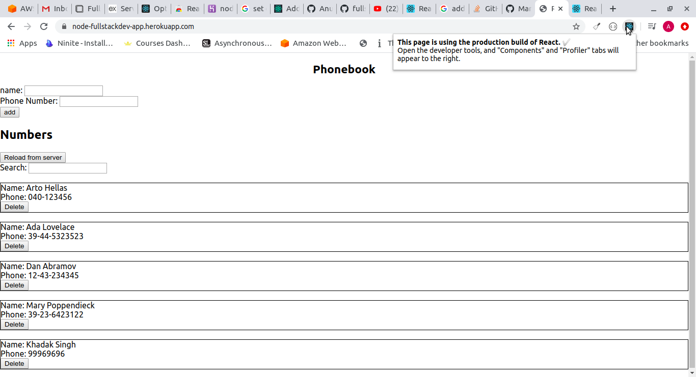
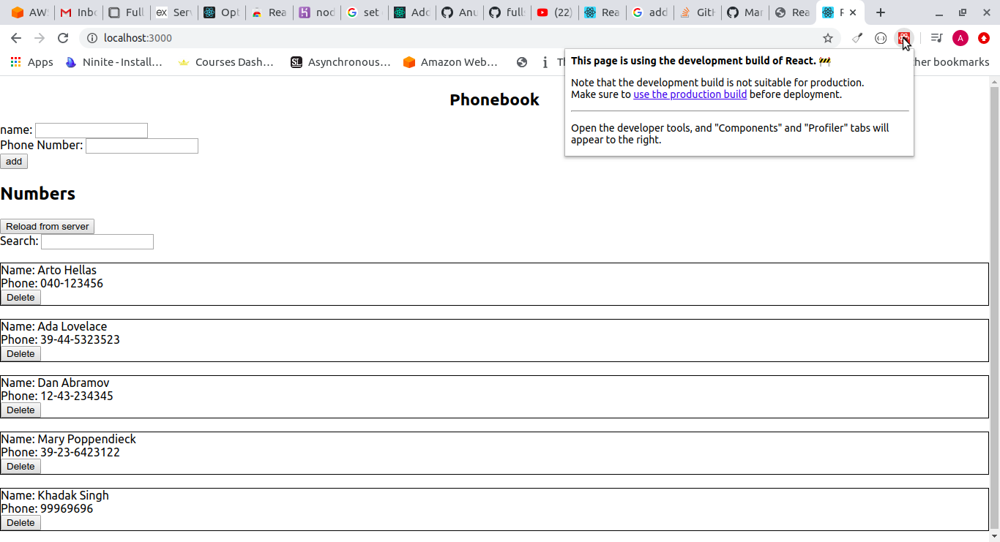

# Part 3

As recommended by the course, I'm putting the submissions for this part in a different repository, since it will need to be deployed later.

Like in part 1 and 2, the convention for any commit meant as a submission for a particular exercise will be the same:

> feat: SUBMISSION - <exercise number\> - <description of exercise solution\>


## Exercise 3.1

Making the actual endpoint that returns the array of persons record, hardcoded in the project, is trivial. Instead of focusing on that, I'd like to describe an alternative modelling on the hardcoded data that I've implemented.

### Alternative Data Modelling:
In the course itself, in this part and in part 2, the hardcoded data was presented as an array of objects. However, I've chosen to model it as an **object with the unique id as key and value as the object itself**.

```
{
  "persons": {
    "1": {
      "name": "Arto Hellas",
      "phoneNumber": "040-123456"
    },
    "2": {
      "name": "Ada Lovelace",
      "phoneNumber": "39-44-5323523"
    },
    "3": {
      "name": "Dan Abramov",
      "phoneNumber": "12-43-234345"
    },
    "4": {
      "name": "Mary Poppendieck",
      "phoneNumber": "39-23-6423122"  
    },
    "5": {
      "name": "Khadak Singh",
      "phoneNumber": "99969696"
    } 
  }
}

```

The major reason I chose to do this is because I would eventually be asked to make an endpoint to return just one result of a given `id`, and that would need me to search the array, making it O(n).
If you're fetching a data record via a unique `id` then ideally it shouldn't be O(n) and the data should be indexed in a way where an object is accessible quickly via its `id`. With this approach, I can certainly return individual records in O(1), although returning the whole list would now be O(n), since the object would need to be converted into an array.

Insert and delete operations will also be O(1) thanks to this approach. Also, when we create a new record, an approach to generating a new `id` for the record could be simply using `index+1`, but that may have its problems with some delete operations followed by inserts, which would mean that a new record could have the same `id` as a deleted record - and that is far from ideal.

**Note**: I have also used the `body-parser` middleware, so parse request payload into json, for when I eventually have to handle POST/PUT requests. This does not play any role in this exercise, but I added it because I usually add this while making any new API with express, so, force of habit.

## Exercise 3.2

This required me to implement a page, and although I could have just returned a string, or some html as a string with the appropriate `Content-Type` header, but I chose to go the extra distance and use **server-side templating** and use the **express-handlebars** package to achieve this.

I'm not a front-end dev and I wasn't familiar with server-side templating, so I used [this article](https://medium.com/@waelyasmina/a-guide-into-using-handlebars-with-your-express-js-application-22b944443b65) to set up handlebars as my default templating engine in express and achieved the result that the exercise asked for.

## Exercise 3.3

Implemented a simple endpoint that takes the `id` as a URL param, and if it isn't found in the data object, returns an http status code of **404** which corresponds to "not found".

## Exercise 3.4

I was a bit confused regarding what the exercise wanted exactly - did I only have to delete the entry from the in-memory object, or did I *also* have to persist the changes in the hardcoded data file, so that when the server is restarted, the changes would reflect?

One look at the first code snippet in the subsection titled "Deleting resources" suggested that we need not persist the changes wherever we had hardcoded them, so merely deleting the record from the in-memory object would suffice, which is what I did.

As for testing the API on postman, I am including screenshots:





## Exercise 3.5

Added a simple POST endpoint to add a new persons entry. I've also included a check for a missing `name` or `phoneNumber` parameter, which is actually part of the next exercise, but I chose to do it from the get go. If any of these mandatory parameters is missing, http status code 404 is returned.

## Exercise 3.6

Added the required param checks - http status code 404 returned in both cases along with an object with a single property "message" describing the error.

## Exercise 3.7

The course was right - the documentation that morgan has is, to put it mildly, less-than-perfect. In fact, although most of it was the same, I found better documentation on how to use morgan with express [in the express docs](http://expressjs.com/en/resources/middleware/morgan.html).

Used it with the "tiny" config, as instructed - the following is a sample of what it logged out to the console on the server:



## Exercise 3.8

I noticed in the docs that I linked earlier that you can indeed specify a custom string to log using morgan, with whatever information you wish to log. So, first I went about constructing that string, and I added another instance of the morgan middleware, with that string. I used the `morgan.token` method to tokenize the request payload (body) and to add that to the log string.

Now the challenge was to only log this for POST requests, so, after some searching, I found [this](https://github.com/expressjs/morgan/blob/master/README.md#skip) and I used this `skip` function as an option in morgan, to log it only for POST requests. Then, I noticed that POST requests were being logged twice, so I used the same `skip` function to not log POST requests in the predefined 'tiny' config, so that POST requests would only be logged once with the custom log string.



## Exercise 3.9

The main things that I accomplished here:
 - Introduce the CORS middleware at the backend
 - Change the baseURL in the frontend (I've made a copy of the front-end for part 3 so that the finished app for part2 remains untouched, and I've made the changed in that, which at the time of writing this, is in a different repo)

The above points were relatively simple to implement.

Also, I got a little carried away and implemented a PUT endpoint on the backend to change the phone numbers, and realised my mistake when I re-read the exercise statement later. Will probably re-do it later.

## Exercise 3.10

First I added the Procfile and copied the one line that the course prescribed into it. Then, instead of following the instructions, I did it my own way, and most of it did *not* involve the command line. I'm not sure if that counts as cheating, but it shouldn't.

I logged into my heroku account (after a long time thanks to this course) and created a new app from the dashboard itself, assuming that there would be some way for me to connect my existing repository on Github to Heroku. Sure enough, there was an option in the "Deploy" tab on the Heroku dashboard for this new app. I connected the repository *AnujPancholi/fullstackopen2020-part3* enabled automatic deploy of the `master` branch, so that Heroku would rebuild my app and deploy automatically if I pushed anything to it.



However, something was wrong, as when I tried to call the persons GET API from the URL of my app, I received an error page from Heroku that asked me to check logs. I figured out the error on my own - it was that I was supplying the wrong command in the Procfile; the line that I copied from the course was `web: node index.js`, whereas I should have modified it to `web: node src/index.js`, since all my actual course code, including the entry file `index.js` was organised in a `src` directory in the root directory of the project.

After this minor fix, it works fine.



## Exercise 3.11

Followed the method prescribed in the exercise precisely, however, the exercise statement mentioned that the dev build should work as well.

So the goal was to deploy a prod build on heroku that used the prod API whereas the dev build would still use the dev API that runs locally, not the prod API deployed to Heroku.

For this, I read some [docs regarding environment variables](https://create-react-app.dev/docs/adding-custom-environment-variables) in create-react-app and found a simple solution - to specify the base URL for the backend API in the env variables, and to use that in the backend wrapper. I set up one env file for the "development" env and another for the "production" env, with the localhost path for the dev build and the relative path (as shown in the course) for the production build, and it works just fine.

Here's the prod build (deployed to Heroku):



And here's the dev build running locally:



## Exercise 3.12

I already had an Atlas account, so I didn't really need to go through the hassle of making the cluster again. So I used the existing cluster, in which I made a new database named `fullstackopen_phonebook`, and created a collection called `entries` in it. I would eventually name the model `Entry` in my script, so the documents would be saved in this collection, as is the convention.

The script works as intended, however, there are just a couple of edge cases that I handled:

 - If no command line params are passed, The script logs an error before exiting.
 - If only a name is given without a phone number (only 2 command line params instead of 3) to make the entry in the database, the second command line param is ignored and all the documents in the entries collection are retrieved.

Also, I would like state that Mongoose has *terrible* documentation.


---